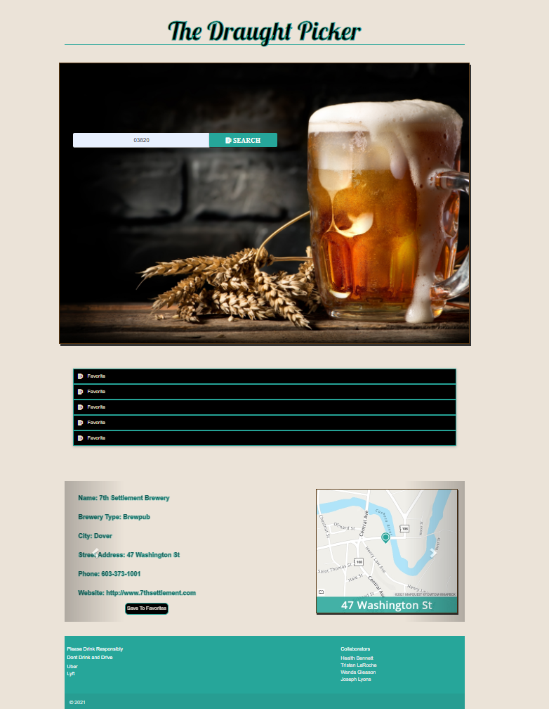
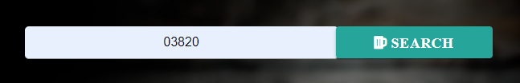
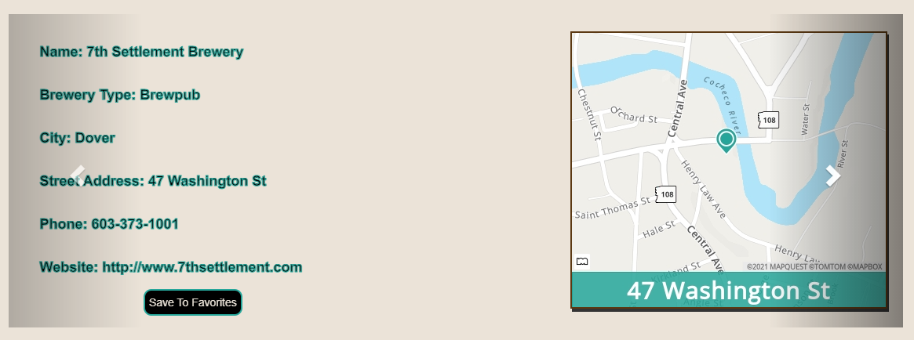
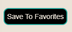
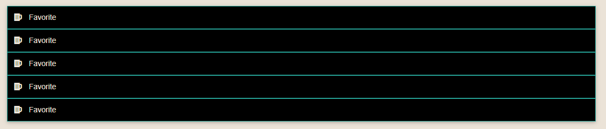
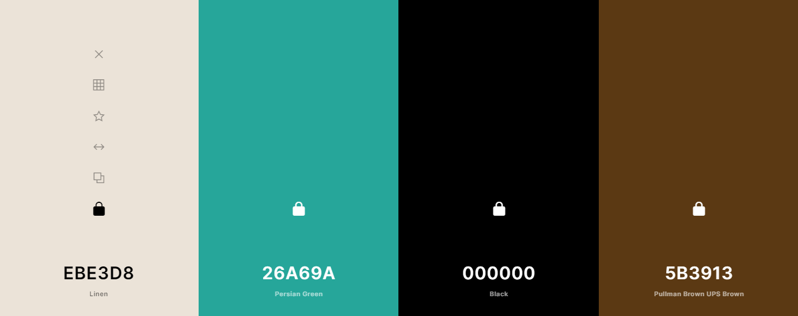

# The Draught Picker

## Project Description

This site allows the user to enter a zip code and receive the name, address, phone number, URL, and type of all the breweries that are local to the zip code.  The user is give the option save up to five locations to their favorites.

&nbsp;

[Link to GitHub repository](https://github.com/Josephjlyons/DraughtPicker)

[Link to deployed page](https://heath-bennett.github.io/weatherDashboard/)

&nbsp;

## Table of Contents

* [Image of Index.html](#Image-of-Index.html)
* [Search Bar](#Search-Bar)
* [Brewery Information](#Brewery-Information)
* [Favorites](#Favorites)
* [Colors Used](#Colors-Used)
* [Resources Used](#Resources-Used)
* [Collaborators](#Collaborators)

&nbsp;

## Image of Index.html

&nbsp;

&nbsp;

## Search Bar&nbsp;

Here the user enters the zip code for the city they wish to drink in.  Upon hitting the search button, the carousel is populated with a map of the location and pertinent information.

&nbsp;

&nbsp;

## Brewery Information

Brewery Information provides the user with the name, type, city, state, street, phone, map, and URL of the breweries local to the zip code provided.  Each location automatically scrolls by until the user hovers over it.  There are also arrow buttons that cycle through each location. 

&nbsp;

&nbsp;

## Favorites

Located in the Brewery Information area is a button to set the current location to favorites.  The user is allowed to save up to five locations. 

&nbsp;

&nbsp;

&nbsp;

## Colors Used in the Project

background and fonts: #EBE3D8  
buttons and borders: #26A69A  
buttons and borders: #000000  
borders:#5B3913

&nbsp;

&nbsp;

## Resources Used

[MapQuest API](https://developer.mapquest.com/documentation/)

[Open Brewery DB API](https://www.openbrewerydb.org/documentation)

[Materialize](https://materializecss.com/)

[Bootstrap](https://getbootstrap.com/)

[Font Awesome](https://fontawesome.com/)

[Google Fonts](https://fonts.google.com/)

[Adobe Color ](https://color.adobe.com/create/image)

&nbsp;

## Collaborators

[Joseph Lyons](https://github.com/Josephjlyons)

[Tristan LaRoche](https://github.com/taroche)

[Heath Bennett](https://github.com/Heath-Bennett)

[Wanda Gleason](https://github.com/wmgleason)

